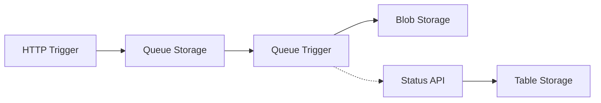

# Weather Station Images Generator

[](https://azure.microsoft.com/en-us/products/functions/)
[](https://dotnet.microsoft.com/download/dotnet/8.0)
[](https://azure.microsoft.com/en-us/products/devops/)

A serverless application that generates weather visualization images for Dutch weather stations using Azure Functions and the Buienradar API.

## 🌟 Features

- **Real-time Weather Data**: Integration with Buienradar API for live Dutch weather information
- **Parallel Processing**: Asynchronous image generation using Azure Queue Storage
- **Serverless Architecture**: Scalable Azure Functions implementation
- **Continuous Deployment**: Automated deployment pipeline using Azure DevOps
- **Status Tracking**: Real-time progress monitoring through REST API
- **Infrastructure as Code**: Complete Azure infrastructure defined in Bicep

## 🏗️ Architecture



## 🚀 Tech Stack

- **.NET 8.0** - Latest LTS version
- **Azure Functions** - Serverless compute
- **Azure Storage** - Queues, Blobs, and Tables
- **Azure DevOps** - CI/CD Pipeline
- **Bicep** - Infrastructure as Code
- **SixLabors.ImageSharp** - Image processing

## 💡 Key Design Principles

- **Serverless Architecture**: Pay-per-use model with automatic scaling
- **Asynchronous Processing**: Non-blocking operations for better performance
- **SOLID Principles**: Clean code architecture with dependency injection
- **Infrastructure as Code**: Reproducible deployments using Bicep
- **Monitoring & Logging**: Application Insights integration

## 📊 API Endpoints

```http
# Generate Weather Images
GET /api/CreateImages

# Check Generation Status
GET /api/status/{jobId}
```

## 🛠️ Local Development Requirements

- Azurite
- .NET 8.0 SDK
- Cosmos DB Emulator
- Azure Storage Explorer   
- Visual Studio 2022 (recommended)

## 🚢 Deployment

```powershell
# Deploy infrastructure
./infrastructure/deploy.ps1 -resourceGroupName "weather-rg" -location "westeurope"
```

## 🔗 Links

- [Buienradar API](https://www.buienradar.nl/overbuienradar/gratis-weerdata)